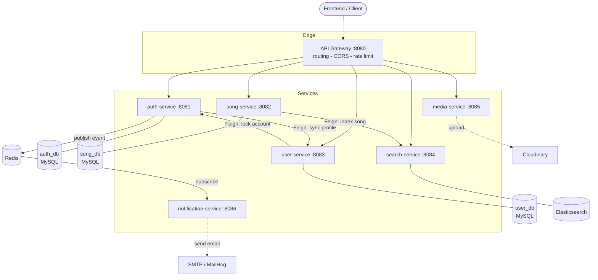
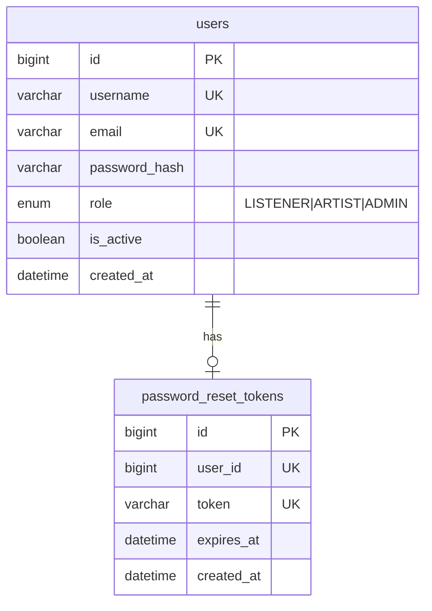
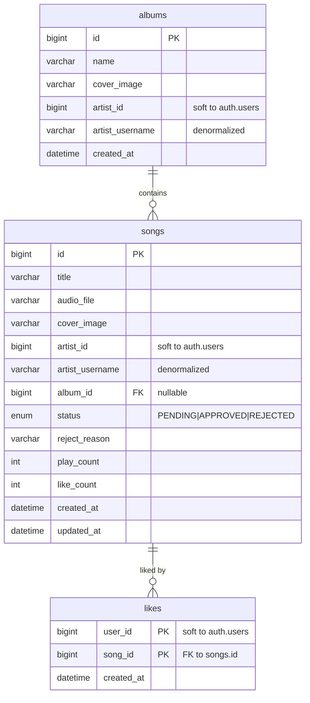
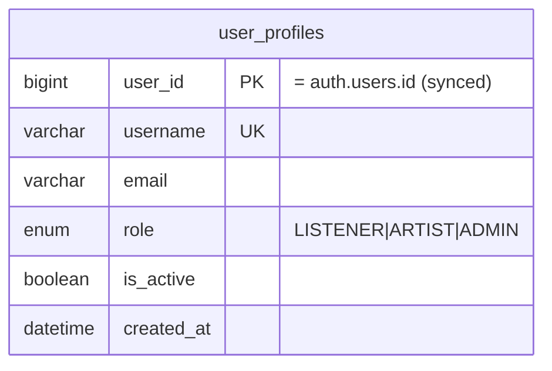

# SoundClown — Music Streaming Microservices

A music streaming platform built with a **microservice** architecture on Spring Boot 3 / Java 21.
Each service owns its own database and communicates over **HTTP (OpenFeign)** and **Redis Pub/Sub**,
behind a single **API Gateway**, with a full **observability** stack (metrics, tracing, dashboards).

> Microservices coursework. At this scale a monolith would be the pragmatic choice — microservices are
> used here to learn, keeping everything as **simple as possible while still illustrating each concept**.

---

## Architecture



**Solid lines** = synchronous (HTTP/Feign, result needed now) - **dashed lines** = asynchronous / external
infrastructure. Every service validates the JWT itself (defense in depth) and exports metrics/traces
(see [Observability](#observability)).

---

## Services

| Service                  | Port | Responsibility                                           | Storage              |
| ------------------------ | ---- | -------------------------------------------------------- | -------------------- |
| **api-gateway**          | 8080 | Single entry point: routing, CORS, rate limit            | —                    |
| **auth-service**         | 8081 | Register / login / JWT / change & reset password         | MySQL `auth_db`      |
| **song-service**         | 8082 | Songs, albums, likes, play count, stats, review          | MySQL `song_db`      |
| **user-service**         | 8083 | Public profiles + admin lock/unlock                      | MySQL `user_db`      |
| **search-service**       | 8084 | Full-text (fuzzy) song search                            | Elasticsearch        |
| **media-service**        | 8085 | Upload audio/images to Cloudinary                        | — (stateless)        |
| **notification-service** | 8086 | Send reset-password email (async)                        | — (Redis subscriber) |
| **common**               | —    | Shared library: `ApiResponse`, `ErrorCode`, JWT, OpenAPI | —                    |

---

## Database schema (one database per service)

> Foreign keys exist **only within a single database**. Cross-service references (e.g. `artist_id`,
> `user_id`) are _soft references_ — no FK, kept consistent via denormalization or event/Feign sync.

### `auth_db` — auth-service



### `song_db` — song-service



### `user_db` — user-service



> **search-service** uses no RDBMS — it indexes a `songs` document in Elasticsearch
> (`id, title, artistUsername, albumName, coverImage, playCount, likeCount, createdAt`).
> **media** and **notification** have no database.

---

## Tech stack

| Area | Technology |
|---|---|
| Language / Runtime | Java 21 |
| Framework | Spring Boot 3.4 |
| API Gateway | Spring Cloud Gateway |
| Security | Spring Security + JWT (jjwt) |
| Persistence | Spring Data JPA, MySQL 8 |
| Search | Spring Data Elasticsearch |
| Inter-service | OpenFeign (sync), Redis Pub/Sub (async) |
| API docs | springdoc OpenAPI (Swagger UI) |
| Observability | Micrometer, Prometheus, Zipkin, Grafana |
| Build & Run | Maven (multi-module), Docker Compose |

---

## Running it

Requires **Docker** + Docker Compose.

```bash
cp .env.example .env        # set JWT_SECRET (and Cloudinary if you want to test uploads)
docker compose up --build   # build and run the whole system
```

| Component              | URL                                       |
| ---------------------- | ----------------------------------------- |
| API Gateway            | http://localhost:8080                     |
| Swagger UI (API docs)  | http://localhost:8080/swagger-ui.html     |
| Zipkin (tracing)       | http://localhost:9411                     |
| Prometheus (metrics)   | http://localhost:9090                     |
| Grafana (dashboards)   | http://localhost:3001 - `admin` / `admin` |
| MailHog (reset emails) | http://localhost:8025                     |

Stop: `docker compose down` (add `-v` to also drop the data volumes).

---

## Observability

The three pillars for observing a distributed system without SSHing into each host:

- **Metrics** — each service exposes `/actuator/prometheus`, Prometheus scrapes them, Grafana charts them.
- **Tracing** — Micrometer Tracing tags every request with a `traceId` and propagates it across the gateway
  and Feign calls; open Zipkin to see which services a request went through and where it was slow.
- **Logs** — `docker compose logs -f` aggregates every container's logs; each log line carries the `traceId`
  for correlation.
- **Health** — every service exposes `/actuator/health`.

---

## Documentation

Full API contract for the frontend: **Swagger UI** (link above) — complete request/response for every endpoint.

### Roles

| Role | Capabilities |
|---|---|
| `LISTENER` | Listen, like |
| `ARTIST` | Upload songs, manage albums (+ everything a LISTENER can do) |
| `ADMIN` | Review/approve songs, lock/unlock users |
