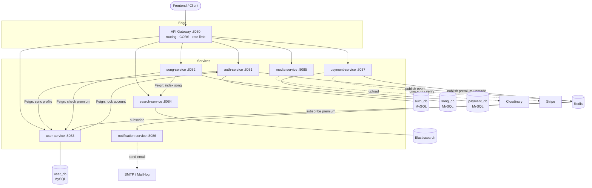
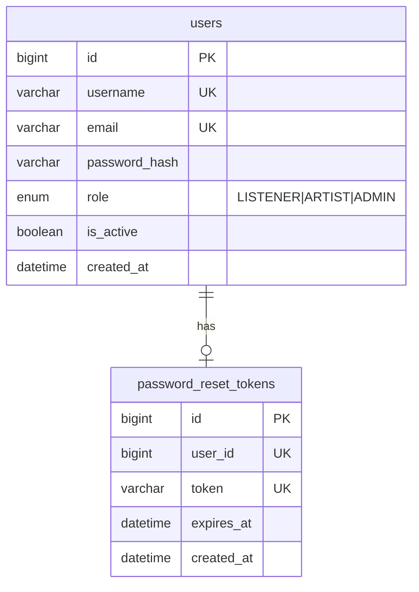
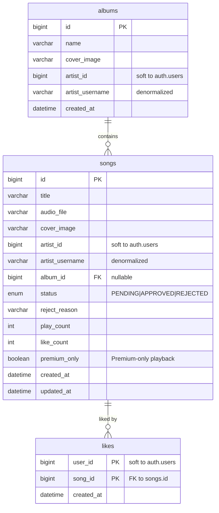
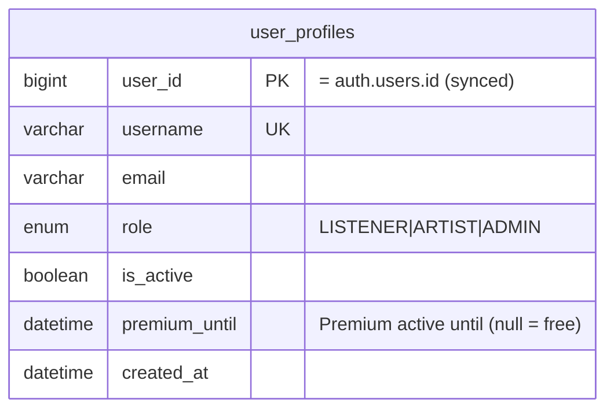
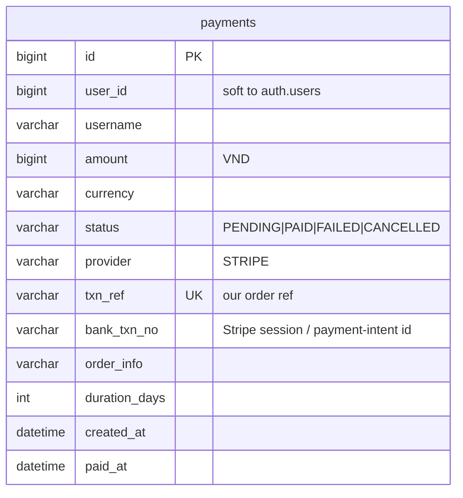

# SoundClown — Music Streaming Microservices

A music streaming platform built with a **microservice** architecture on Spring Boot 3 / Java 21.
Each service owns its own database and communicates over **HTTP (OpenFeign)** and **Redis Pub/Sub**,
behind a single **API Gateway**, with a full **observability** stack (metrics, tracing, dashboards).

> Microservices coursework. At this scale a monolith would be the pragmatic choice — microservices are
> used here to learn, keeping everything as **simple as possible while still illustrating each concept**.

---

## Architecture



**Solid lines** = synchronous (HTTP/Feign, result needed now) - **dashed lines** = asynchronous / external
infrastructure. Every service validates the JWT itself (defense in depth) and exports metrics/traces
(see [Observability](#observability)).

---

## Services

| Service                  | Port | Responsibility                                           | Storage              |
| ------------------------ | ---- | -------------------------------------------------------- | -------------------- |
| **api-gateway**          | 8080 | Single entry point: routing, CORS, rate limit            | —                    |
| **auth-service**         | 8081 | Register / login / JWT / change & reset password         | MySQL `auth_db`      |
| **song-service**         | 8082 | Songs, albums, likes, play count, stats, review          | MySQL `song_db`      |
| **user-service**         | 8083 | Public profiles + admin lock/unlock                      | MySQL `user_db`      |
| **search-service**       | 8084 | Full-text (fuzzy) song search                            | Elasticsearch        |
| **media-service**        | 8085 | Upload audio/images to Cloudinary                        | — (stateless)        |
| **notification-service** | 8086 | Send reset-password email (async)                        | — (Redis subscriber) |
| **payment-service**      | 8087 | Premium subscription checkout via Stripe                 | MySQL `payment_db`   |
| **common**               | —    | Shared library: `ApiResponse`, `ErrorCode`, JWT, OpenAPI | —                    |

---

## Database schema (one database per service)

> Foreign keys exist **only within a single database**. Cross-service references (e.g. `artist_id`,
> `user_id`) are _soft references_ — no FK, kept consistent via denormalization or event/Feign sync.

### `auth_db` — auth-service



### `song_db` — song-service



### `user_db` — user-service



### `payment_db` — payment-service



> **search-service** uses no RDBMS — it indexes a `songs` document in Elasticsearch
> (`id, title, artistUsername, albumName, coverImage, playCount, likeCount, createdAt`).
> **media** and **notification** have no database.

---

## Tech stack

| Area               | Technology                                           |
| ------------------ | ---------------------------------------------------- |
| Language / Runtime | Java 21                                              |
| Framework          | Spring Boot 3.4                                      |
| API Gateway        | Spring Cloud Gateway                                 |
| Security           | Spring Security + JWT (jjwt)                         |
| Persistence        | Spring Data JPA, MySQL 8, Flyway (schema migrations) |
| Search             | Spring Data Elasticsearch                            |
| Inter-service      | OpenFeign (sync), Redis Pub/Sub (async)              |
| API docs           | springdoc OpenAPI (Swagger UI)                       |
| Observability      | Micrometer, Prometheus, Zipkin, Grafana              |
| Build & Run        | Maven (multi-module), Docker Compose                 |

---

## Running it

Requires **Docker** + Docker Compose.

```bash
cp .env.example .env        # set JWT_SECRET (+ Cloudinary for uploads, Stripe key for payments)
docker compose up --build   # build and run the whole system
```

| Component             | URL                                       |
| --------------------- | ----------------------------------------- |
| API Gateway           | http://localhost:8080                     |
| Swagger UI (API docs) | http://localhost:8080/swagger-ui.html     |
| Zipkin (tracing)      | http://localhost:9411                     |
| Prometheus (metrics)  | http://localhost:9090                     |
| Grafana (dashboards)  | http://localhost:3001 - `admin` / `admin` |

Stop: `docker compose down` (add `-v` to also drop the data volumes).

### Deploy a single service

Each service has its own `Dockerfile` for independent deployment (one server / pipeline per
service). Because it's a Maven multi-module build, **the build context is the repo root** (it needs
the parent pom + `common`):

```bash
docker build -f auth-service/Dockerfile -t soundclown-auth-service .   # note the trailing "."
docker run -e SPRING_DATASOURCE_URL=... -e JWT_SECRET=... -p 8081:8081 soundclown-auth-service
```

### Deploy on a VPS (Docker Compose)

The whole stack runs on a single host. Suggested: a VPS with **Docker + Compose** and **~4 GB RAM**
(Elasticsearch alone wants ~1 GB).

```bash
git clone <repo> && cd soundclown-services
cp .env.example .env          # set a strong JWT_SECRET, DB_PASSWORD, Cloudinary creds
docker compose up -d --build
```

> **Security — important.** Compose publishes every port on `0.0.0.0`, including **Redis (6379)** and
> **Elasticsearch (9200)** which have **no auth**. On a public IP that is a real risk. Lock it down at
> the VPS firewall — expose only SSH and the gateway:
>
> ```bash
> sudo ufw allow 22/tcp && sudo ufw allow 8080/tcp && sudo ufw enable
> ```
>
> Then reach internal UIs (Grafana, Zipkin, …) via an SSH tunnel, e.g.
> `ssh -L 3001:localhost:3001 your-vps` → open `localhost:3001`.

- **TLS / domain**: put Caddy or nginx in front of `:8080` (Caddy gives auto-HTTPS in ~3 lines), then
  also allow `80/443` in the firewall.
- **Email**: set `SMTP_HOST/PORT/USER/PASS` (e.g. Gmail/SendGrid) so reset-password mail is delivered.
- **Payments**: set a test `STRIPE_SECRET_KEY` ([dashboard](https://dashboard.stripe.com/test/apikeys),
  no approval needed). Point `STRIPE_RETURN_URL` / `PAYMENT_RESULT_URL` at URLs reachable from the
  user's browser; test with card `4242 4242 4242 4242`.
- If you seeded songs, populate search once:
  `curl -X POST http://localhost:8082/internal/songs/reindex` (run it on the VPS).

### Seed accounts

On a fresh database, three accounts are seeded automatically (password `password123`):

| Username   | Role     | Can                              |
| ---------- | -------- | -------------------------------- |
| `admin`    | ADMIN    | review/approve songs, lock users |
| `artist`   | ARTIST   | upload songs, manage albums      |
| `listener` | LISTENER | listen, like                     |

> Schema is managed by **Flyway** migrations (`src/main/resources/db/migration` in each
> stateful service); Hibernate runs in `validate` mode and does not alter tables.

---

## Observability

The three pillars for observing a distributed system without SSHing into each host:

- **Metrics** — each service exposes `/actuator/prometheus`, Prometheus scrapes them, Grafana charts them.
- **Tracing** — Micrometer Tracing tags every request with a `traceId` and propagates it across the gateway
  and Feign calls; open Zipkin to see which services a request went through and where it was slow.
- **Logs** — `docker compose logs -f` aggregates every container's logs; each log line carries the `traceId`
  for correlation.
- **Health** — every service exposes `/actuator/health`.

---

## Documentation

Full API contract for the frontend: **Swagger UI** (link above) — complete request/response for every endpoint.

### Roles

| Role       | Capabilities                                                 |
| ---------- | ------------------------------------------------------------ |
| `LISTENER` | Listen, like                                                 |
| `ARTIST`   | Upload songs, manage albums (+ everything a LISTENER can do) |
| `ADMIN`    | Review/approve songs, lock/unlock users                      |

### Premium (subscription)

Orthogonal to roles — any account can buy **Premium** (30 days) to play `premium_only` songs.
`POST /api/payments/checkout` returns a **Stripe Checkout** URL; on the return payment-service confirms
the session and publishes a `premium-upgrade` event, user-service sets `premium_until`, and song-service
then allows premium-only playback (premium checked via Feign; `ADMIN` bypasses the gate, while
non-premium users get `1305 SONG_PREMIUM_REQUIRED` on `play`).
